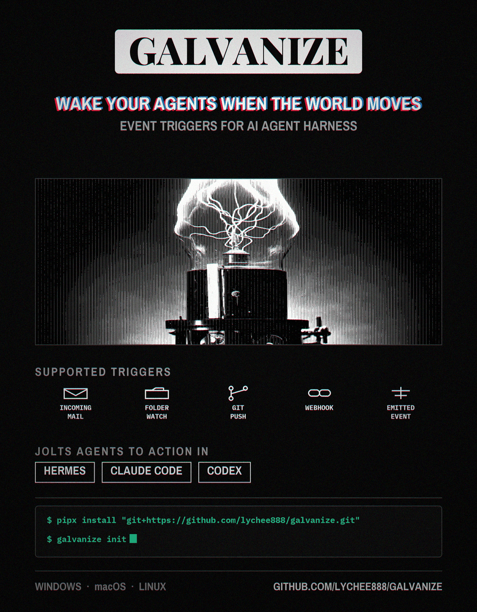

**Wake your AI agent when something happens.**

galvanize watches the real world (new mail, a file landing in a folder, a git commit, a webhook call, an event from a script) and starts a fresh AI agent session with a prompt you wrote the moment one occurs. Event triggers sit directly in the agent's own tool list (native plugin for Hermes, MCP server for Claude Code and Codex), so "wake me when resumes land" wires an actual push trigger. Passwords go to your OS keyring, each trigger starts watching in seconds, and results arrive wherever you asked (Telegram, Discord, or the log).

## Install

Works on Windows, macOS, and Linux (Python 3.10+). No cloning needed; one command installs straight from GitHub:

```bash
pipx install "git+https://github.com/lychee888/galvanize.git"
# or: uv tool install --from "git+https://github.com/lychee888/galvanize.git" galvanize
# or: pip install git+https://github.com/lychee888/galvanize.git
```

Then run setup once:

```bash
galvanize init
```

`init` enables the Hermes webhook platform (backs up your config first), installs the agent plugin, registers the daemon to start at login, and auto-registers the MCP tool surface into Claude Code / Codex if it finds them on this machine. Everything is confirmed on screen and reversible; `--yes` accepts defaults.

After that, the whole surface is five verbs:

```bash
galvanize add folder ~/watch --wake hermes             # + a live test fire
galvanize add imap you@gmail.com --wake hermes         # app-password to keyring
galvanize status           # watching? last fire, errors, health
galvanize doctor           # deep health check
galvanize test cad-drops   # inject a synthetic event through the real path
```

## Why

Cron polling is usually the only event surface an agent can see, so "trigger me when X" becomes an hourly poller. galvanize puts event triggers *in the agent's own tool list*, so the agent wires a real push trigger.

- **Fresh sessions.** Each event spawns a clean one-shot run; results are delivered where you asked.
- **Management everywhere cron is managed.** Dashboard `/triggers` tab, `/triggers` slash command, `hermes triggers` CLI, agent tools, plus `galvanize status` / `doctor` / `daemon`: all surfaces, one ops core.
- **Push email.** IMAP IDLE with 25-min re-arm, UID dedupe, reconnect catch-up, keyring-held credentials, and a `migrate hermes-cron` command that converts your existing email pollers.
- **Zero-inbound-port webhooks.** Optional user-owned Cloudflare Worker relay (`relay/worker.js`): services POST to your URL, your laptop pulls the queue.

## Working with each harness

### Hermes

`galvanize init` does the setup: enables `platforms.webhook` in your `config.yaml` (backup saved first), pip-installs the package into the interpreter Hermes runs in, copies the plugin into `~/.hermes/plugins` and enables it. Restart the Hermes gateway once to load the webhook platform; the `trigger_*` tools appear in new sessions. From then on, "wake me when a file lands in ~/cad-drops" creates a real trigger in conversation.

### Claude Code / Codex

`init` writes the MCP server entry into `~/.claude.json` / `~/.codex/config.toml` automatically when it finds them (Codex gets `default_tools_approval_mode = "approve"` pre-declared, as newer Codex builds otherwise hide the tools). New session: `trigger_add` and friends are in the tool list. Wake presets:

```bash
galvanize add folder ~/inbox --wake claude   # claude -p "{prompt}"
galvanize add folder ~/inbox --wake codex    # codex exec (sandbox pre-declared)
galvanize add git-hook ~/code/myrepo --wake codex   # wake Codex on commits
```

### Any other CLI agent

`galvanize add ... --wake dsh` defaults to `dsh --profile headless "{prompt}"`.
The DSH plugin installer saves a custom `--wake-profile` into both its runtime
profiles and the core's `dsh_wake_profile` setting, so future CLI and plugin
triggers agree. The CLI also accepts `--wake-profile <name>` for one trigger.
Existing triggers retain their saved commands. MCP `trigger_add` requires an
explicit `wake` target and accepts `command`, `workdir`, `wake_profile`,
`relay_url`, and `relay_token`; it does not silently choose Hermes.

```bash
galvanize add folder ~/watch --wake shell --command 'myagent run "{prompt}"'
```

Commands containing `{prompt}` or `{payload}` run as an executable plus literal arguments. Event text is never interpolated into a shell command. Use a script for pipelines or redirection, and read `GALVANIZE_PROMPT` / `GALVANIZE_PAYLOAD` inside it. On Windows, npm command shims are resolved to their Node entry point; other batch files need an explicit executable or interpreter.

### Relay webhooks

DSH and other shell wakes require a relay for webhooks. Deploy `relay/worker.js` with a `RELAY` KV binding and two distinct secrets: `RELAY_TOKEN` for the daemon to read events, and `INGEST_TOKEN` for senders to submit events. Set both using `wrangler secret put` before deploying.

```bash
galvanize add webhook --name incoming --wake dsh \
  --relay https://your-relay.workers.dev --relay-token "$RELAY_TOKEN"
curl -X POST https://your-relay.workers.dev/ingest/incoming \
  -H "Authorization: Bearer $INGEST_TOKEN" \
  -H 'Content-Type: application/json' -d '{"message":"hello"}'
```

The supplied worker requires the ingestion bearer header. Providers that cannot send it need an adapter that validates their native signature before forwarding; pointing their unauthenticated webhook directly at the worker will return 401. Existing deployments must configure `INGEST_TOKEN` and update senders when installing this worker revision.

Relay receipt and delivery are persisted separately in per-URL SQLite inboxes
under `GALVANIZE_HOME` (default `~/.galvanize`). A page and its receipt cursor
commit together before dispatch. The delivery acknowledgement advances only
past successful or explicitly quarantined events. A failed wake never advances
that acknowledgement; later received events can still run. Normal restarts
resume pending work and do not replay acknowledged IDs, including retained
history returned again by the relay.

Delivery is **at least once**, not exactly once: a crash after a wake's external
side effect but before the acknowledgement commit can repeat it. Every payload
includes the stable relay `event_id`; use that ID for idempotent side effects.
Keep the inbox files when restarting. Deleting them intentionally resets replay
protection. IDs are retained without automatic pruning; monitor disk usage for
long-running, high-volume deployments. Events not received before the Worker's
retention period expires cannot be recovered locally. Cloudflare KV is eventually
consistent; this change does not make its timestamp cursor a transactional queue.

Failed dispatches retry up to five times with bounded exponential delay (2, 4,
8, 16 seconds before exhaustion). `galvanize status` and `trigger_status` expose
event ID, attempts, and error. After fixing the cause, use
`galvanize relay-retry <event-id>` to grant another five attempts. Cooldown and
in-flight deduplication deferrals remain pending and are checked again after
two seconds without spending a failed-dispatch attempt. Malformed records are
quarantined individually and remain visible. The Worker wraps
non-object JSON as `{"value": ...}` and non-JSON text as `{"raw": ...}`; the
reader also normalizes retained records from older Workers.

`watching` requires a fresh, connected watcher and a live daemon for folder,
IMAP, and relay sources. Direct Hermes webhooks use gateway health instead;
manual emit triggers have no watcher. IMAP exits IDLE with DONE before searching
or fetching mail, then re-enters IDLE after draining.

## Daily use

The agent's own `trigger_add` tool is the primary creation path; the CLI is the fallback for use without an agent. Both write the same `~/.galvanize/triggers.yaml`, and the dashboard tab manages what either creates.

## Development

```bash
git clone https://github.com/lychee888/galvanize && cd galvanize
python -m venv .venv && .venv/bin/pip install -e ".[dev]"   # Scripts/ on Windows
.venv/bin/pytest                     # unit suite; live-lane + docker tests skip cleanly
```

The live Hermes-lane test runs inside a Hermes checkout's venv (`pytest tests/test_live_hermes_lane.py`); the IMAP suite drives a GreenMail container and skips when Docker is unavailable. `test_imap_protocol.py` always exercises the real IMAP client over TCP against a strict test server that rejects commands during IDLE. Relay Worker tests execute the actual JavaScript with a memory-backed KV fixture, not a Cloudflare deployment.

MIT licensed. Built for the Hermes ecosystem; architecture is harness-neutral.
